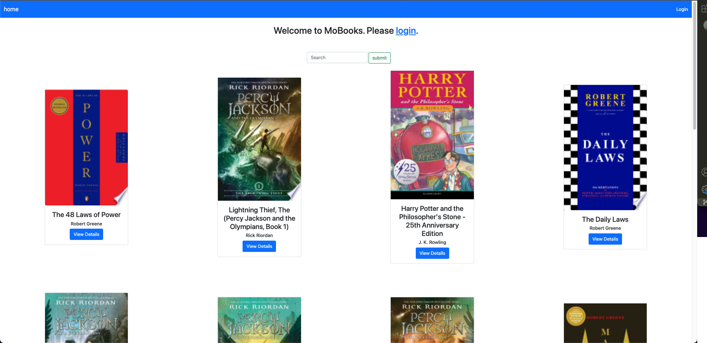
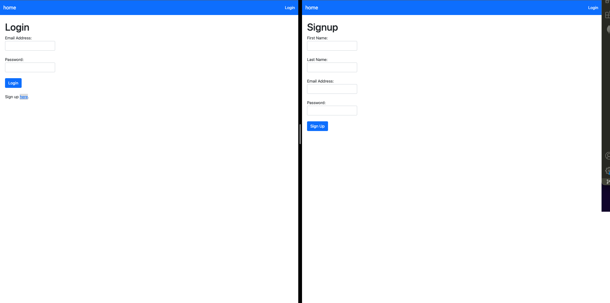
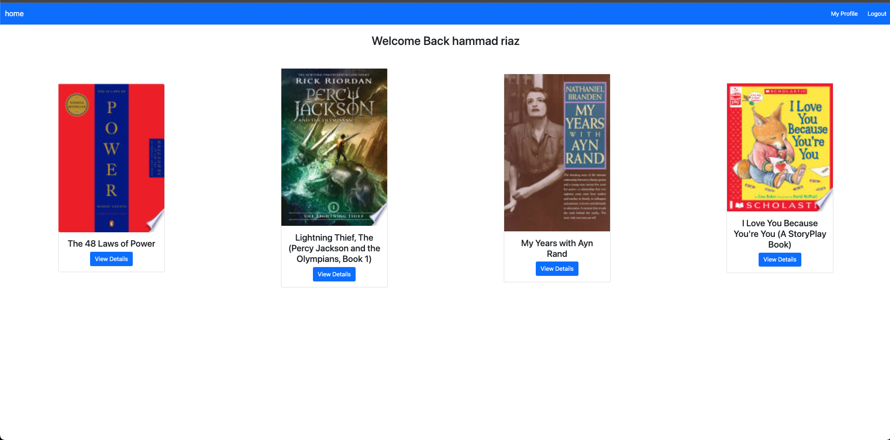
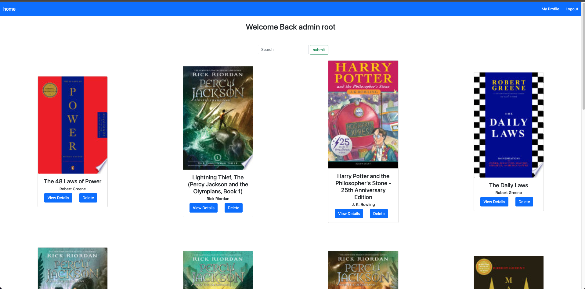

# **MoBooks**

## Book Review App

MoBooks lets user search and read reviews and other information about the books they love, courtesy of google books api. it also lets logged in users save books to their respective libraries where they can rate those books. Users can also remove books from their libraries. The admin user has the authority to delete a book completely with all of its information from the explore page.

## Screenshots

## Technologies Used

- Express JS
- Node JS
- MongoDB
- MongoDB Atlas
- HTML
- CSS
- JavaScript
- Bootstrap 5
- Google Books API

## Getting Started

The app can be accessed [here](https://mobooks.herokuapp.com/)

## Future Work

- **Admin Privileges Beyond Deleting Homepage Items:**
Admin user will be able to update and delete all users, authors, ratings and books. Admin will have a dedicated analytics page used for gauging website engagement along with other web element data
- **Top 5 Rated and Top 5 Most Viewed on Homepage:**
First 2 rows will display the top 5 most viewed and top 5 most rated books. there will be sections dedicated to homepage for non logged in users and sections for logged in users on their own library pages.
- **Top Authors:**
Will incorporate top authors for data analytics purposes